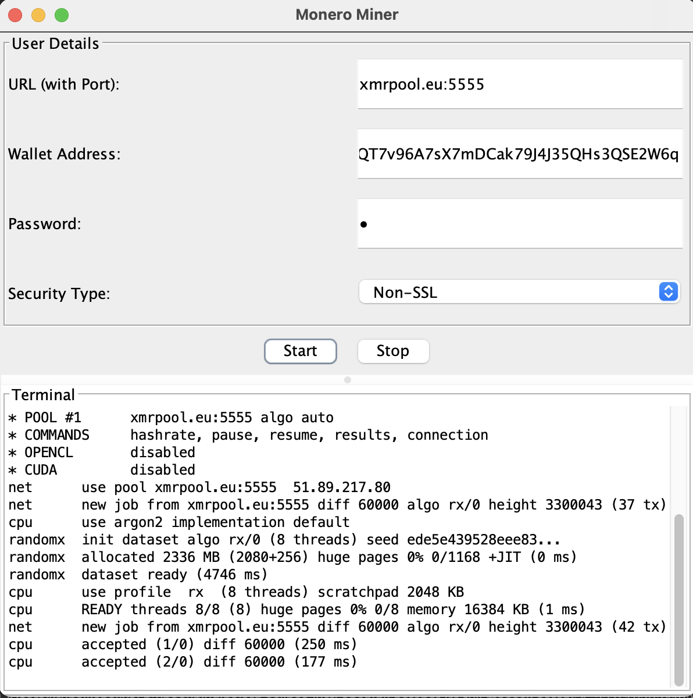

# Monero XMR CPU Miner in Java

I was developed this project for fun and learning perspective, Also for open-source code. So, people can intersect with this code and increase efficiency.

## Usage

- I Used Simple JFrame with FlowLayout for Dividing user and log part.
- Plugin in Play code for Eclipse Users :D

### Example Output

---

## Note

This Monero Miner is MacOS Specific. In future i will share build for windows and Linux.
